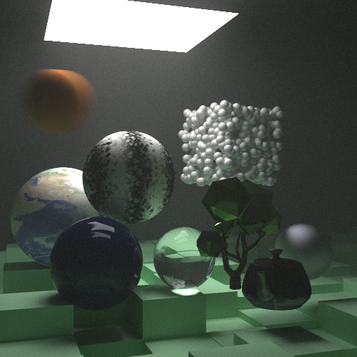

# Ray Tracing: The Next Week
Implementation based on Peter Shirley's Ray Tracing minibooks.
 

- Final scene of "Ray Tracing: In a Weekend", with a 1920x1080 resolution and 50 samples per pixel.
 

- Final scene of "Ray Tracing: The Next Week", with a 500x500 resolution and 10k samples per pixel.
 
 ## Current Features:
- Multithreaded implementation.
- Each material, texture and hitable has its own file, which helps modularization.
- Supports PNG output, through STB Image Write - http://nothings.org/stb/stb_image_write.h
- Triangle intersection code based on Morgan McGuire's 'The Graphics Codex' - http://graphicscodex.com
- Supports OBJ models with (partial) MTL material support, through Bly7's OBJ Loader - https://github.com/Bly7/OBJ-Loader
- XorShift32 random generator by Aras Pranckevicius - https://github.com/aras-p/ToyPathTracer/blob/master/Cpp/Source/Maths.cpp#L5-L18

## TODO:
- Add support to other MTL properties
- Change structures to C++ STD structures
- Change common pointers to shared pointers
- Fix multithread performance issue
- Transparency and other features: https://github.com/aromanro/RayTracer
- Port to CUDA: https://devblogs.nvidia.com/accelerated-ray-tracing-cuda/

All credits go to Peter Shirley. For more info and how to get the books: https://twitter.com/Peter_shirley/status/1029342221139509249

Implemented during an undergraduate research project mentored by prof. Hélio Pedrini at the Institute of Computing - Unicamp.
